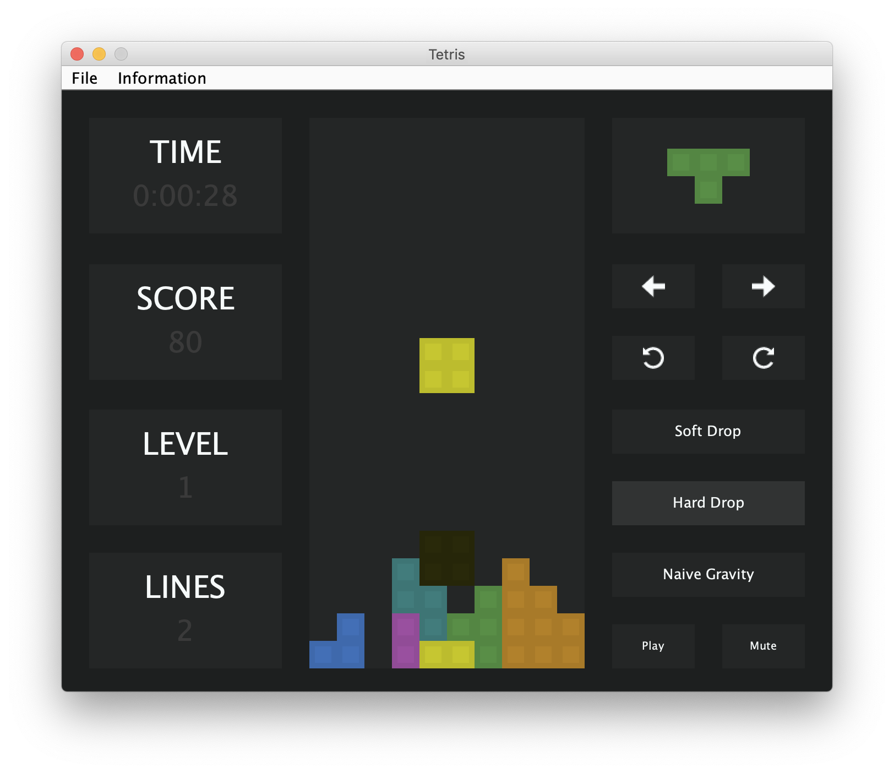

# Tetris
> Tetris game clone for CS342 at the University of Illinois at Chicago


<p align="center" >
	
</p>

## About

The two design patterns used in this project are **Factory** and **Singleton**. **Factory** pattern occurs in Tetromino ([Tetromino.java](src/main/java/com/tetris/Tetromino.java)) and all the Sub TetrominoX classes. We implemented our tetrominoes such that the parent _Tetromino_ class deals with all the movements and the modifications we make to the tetrominoes and the subclasses just deal with creating a tetromino with a specific spawning coordinates. **Singleton** pattern occurs in the _Shadow_ class ([Shadow.java](src/main/java/com/tetris/Shadow.java)). This class, whose job is to spawn a shadow of the current piece, is implemented in such a way that an instance of shadow can not be made and has static methods.

## Building & Running & Cleaning

This project uses Maven as it's build system. If you would like to build and run the application from source, then the following commands will prove useful.

#### Compile Classes & Package JAR

```shell
mvn package
```

#### Run Main Class From JAR

```shell
java -cp target/tetris-1.0.0.jar com.tetris.Tetris
```

Once the program launches, you can play the game using the on-screen buttons. Alternatively, open **Information > Help** to get playing instructions and keyboard shortcuts.

#### Clean Generated Files

```shell
mvn clean
```

> **Note**: This will not delete the var folder that contains your highscores.
